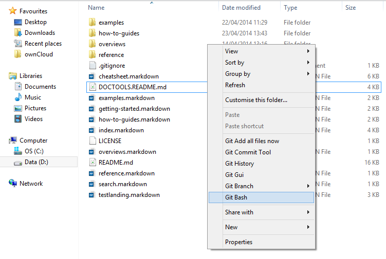

# Documentation Tools Cheatsheet for Beginners

CFEngine technical documentation is written using a Markdown formatting (see [Markdown Cheatsheet][Markdown Cheatsheet]) and published using a combination of Jekyll and various plugins (see [CFEngine Documentation][CFEngine Documentation]).

The various Markdown and other files (e.g. images) that make up the volume of CFEngine documentation are held in a master source code repository. Contributors to the documentation make their own changes in local copies of the documentation Markdown on their own machines and then push those changes to a remote branch.

From there a request is made to merge the modifications back into the mainline, from which the Jekyll tooling will be triggered to import and then render the final documentation in HTML.

## Git and GitHub ##

Git is the repository system in use for CFEngine technical documentation, and the remote repositories are hosted on GitHub.

Git (http://git-scm.com) is a revision control and source code management system to help manage the iterative development of software products in distributed environments. It is an open source product originally developed by Linus Torvalds to help manage Linux kernel development.

Git allows contributors to a project to work independently in their own copy (aka `branch` of the mainline project) and then to have any modifications they make to be merged back. This branching mechanism also provides functionality for documenting each change, rewinding changes and more.

GitHub (https://github.com) is an online service for hosting Git project
repositories. It helps provide organizations the infrastructure and tools to
setup then manage repositories and users that they would otherwise need to do
themselves. In general it contains many features and improvements to a normal
Git workflow.

### Downloading and Installing Git on Windows ###

1. Go to the Git website at http://git-scm.com/
2. Go to the download section. At the time of writing this was http://git-scm.com/downloads.
3. Select the appropriate platform. In this case select Windows.
4. Wait for the install application to download.
5. Launch the downloaded installer application.
6. If you see a security warning select `Run`, and for `User Account Control` select `Yes`.
7. Follow the instructions in the installer. It is safe to accept all the default values.

### Launching Git Bash ###

1. Using Windows Explorer, open a directory where you wish to store CFEngine related Git repositories (e.g. D:\Projects\CFEngine).
2. Right click to bring up the contextual menu.
3. Select `Git Bash`

4. A `Command Prompt` style window will open. This is where you will enter Git commands.

### Using Git ###

Git is a very powerful and robust command line tool at its heart. While it has a great number of commands, some of which are similar to one another, for the beginner there are generally only a few simple ones they need to learn to get started -- and a few more complicated ones to get themselves out of trouble!

#### Good Git Commands to Learn ####

* clone
* add
* commit
* push
* pull
* reset

#### Basic Examples ####

Note: Statements using the following format `> git command something` are to be done on the command line (e.g. Command Prompt/PowerShell on Windows, bash etc. on Linux / Mac). Do not type the `>` at the start of the statement -- beging typing the instructions that follow it (e.g. `git...`).

##### Cloning a Remote Repository #####

1. `> git clone https://github.com/cfengine/documentation.git`

This will clone the repository from the URL indicated into a sub-directory called `documentation`.

##### Cloning a Remote Repository, Making and Committing Changes #####

1. `> git clone https://github.com/cfengine/documentation.git`
2. Edit any of the files in the `documentation` sub-directory.
3. `> git commit -a -m "This is a note about the changes that were made"`

##### Cloning a Remote Repository and Configuring a `Remote` #####

1. `> git clone https://github.com/cfengine/documentation.git`
2. `> cd documentation`
3. `> git remote add upstream https://github.com/cfengine/documentation.git`

Note: If working with a clone that you do not have rights to push to then you will need to add a remote for it and push changes to there first.

### Git (and Related) Resources ###

* The Wikipedia article on Git provides a good overview of the software: http://en.wikipedia.org/wiki/Git_(software).
* The official Git documentation has excellent content for learning how to use Git: http://git-scm.com/documentation.
* GitHub's Help section has many useful tips and tricks, as well as guidance on how to setup Git, create Git repos, fork of repos and contribute to Git supported software projects: https://help.github.com/

