Now that you've installed CFEngine, and used the Web UI a bit, let's take a look at extending it with modules.
CFEngine Build enables users to find useful modules on the website, [build.cfengine.com](https://build.cfengine.com), and easily add them to their policy.

The workflow will look like this:

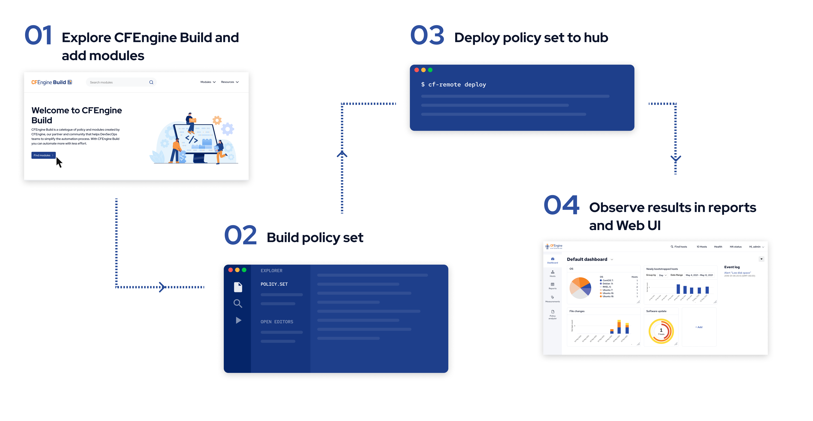

You can work on CFEngine Build projects both from inside Mission Portal, and using our command line tools.
In this tutorial, we will do it from inside Mission Portal.

## Step 0: Creating a new project

When you are logged in to Mission Portal, click the **Build** application in the left menu.

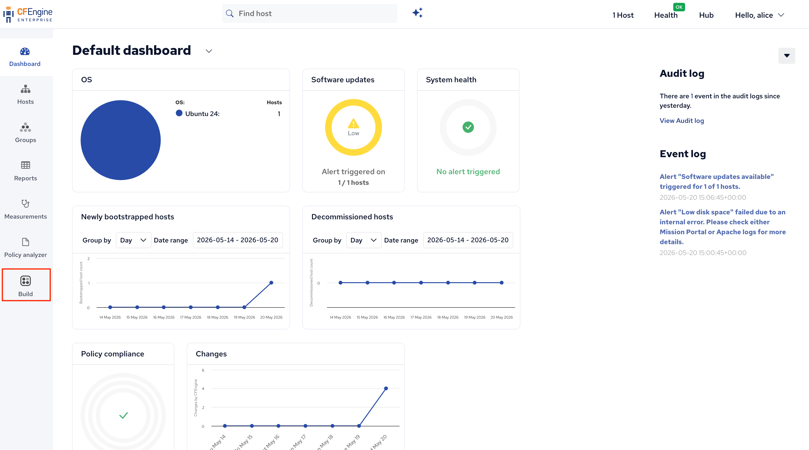

If you do not have any pre-existing Build projects, you will be automatically prompted to create a new one:

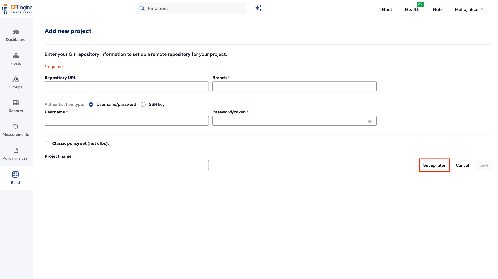

On this screen, you can enter details to make your project be synced with a git repository (for example on github.com).
At this point, since we are just testing things, feel free to just click **Set up later**.

You will be prompted to select a version of the masterfiles policy framework (the CFEngine policy files that come with CFEngine).
In general, the default is the best option, it will choose a version matching the version of CFEngine you are running.
Click **Confirm**.

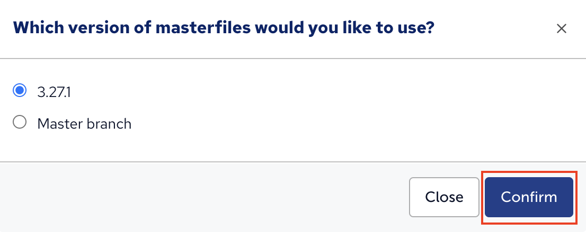

## Step 1: Explore and add modules

You will see a welcome screen which gives you an introduction to CFEngine Build:

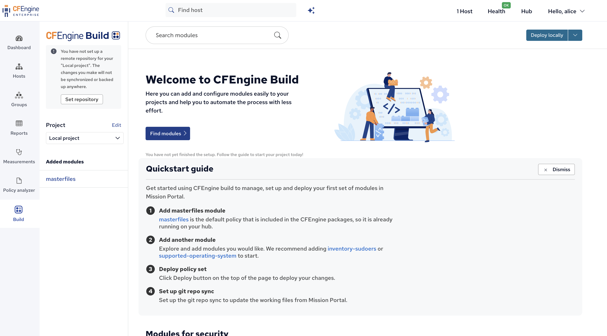

The search bar here searches for modules from [build.cfengine.com](https://build.cfengine.com).
Let's add some modules;

Search for `compliance-report-lynis` and click on the search result;

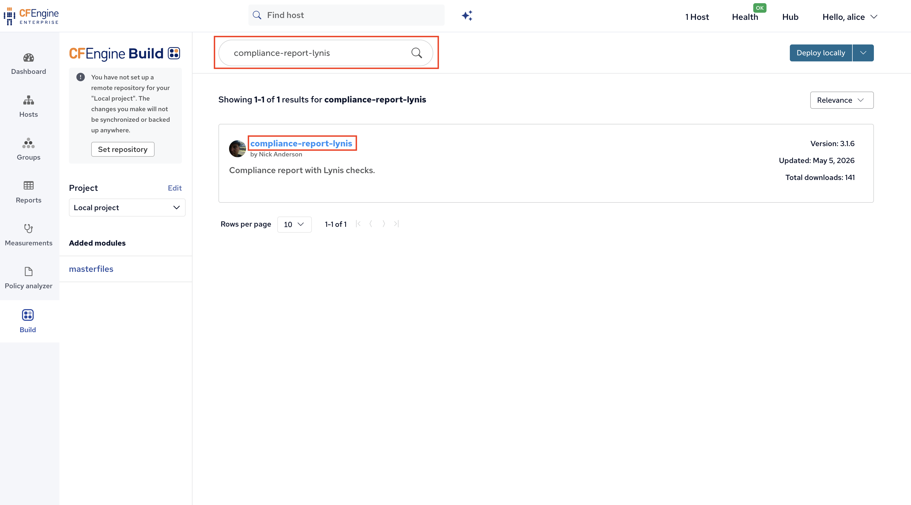

Click **Add module** to add it to your project:

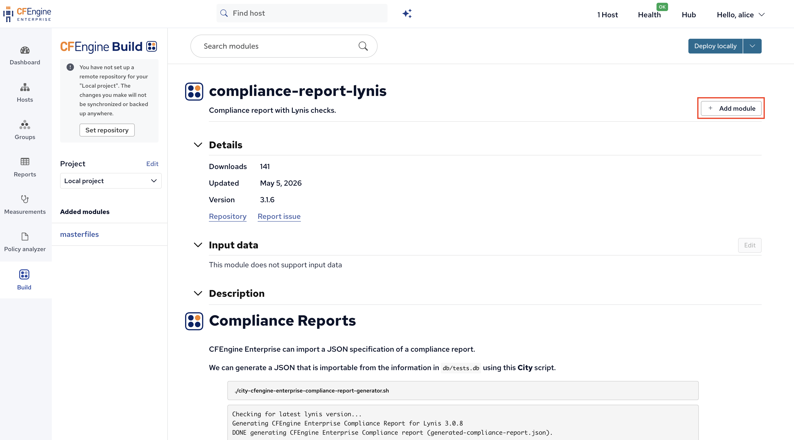

Feel free to add more modules, for example search for `inventory` and add `inventory-etc-hosts`, or any other module which seems useful.
Generally, `inventory-` modules add useful information to the reporting inventory and don't require any configuration or input to work.

On the left side of the application we can see the modules we've added:

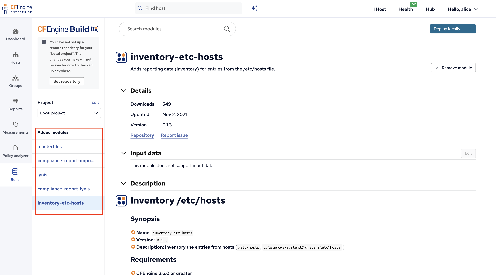

## Step 2 & 3: Build & deploy

In order to get these modules actually running, a few things need to happen:

1. **Building:** Downloading all the modules and combining them into one policy set.
2. **Deploying:** Transferring that policy set to the right folder on the hub.
3. **Updating / enforcing:** This happens automatically - once the policy is there, all the hosts will start fetching and running it.

In Mission Portal, we achieve this by simply clicking the **Deploy locally** button in the top right corner:

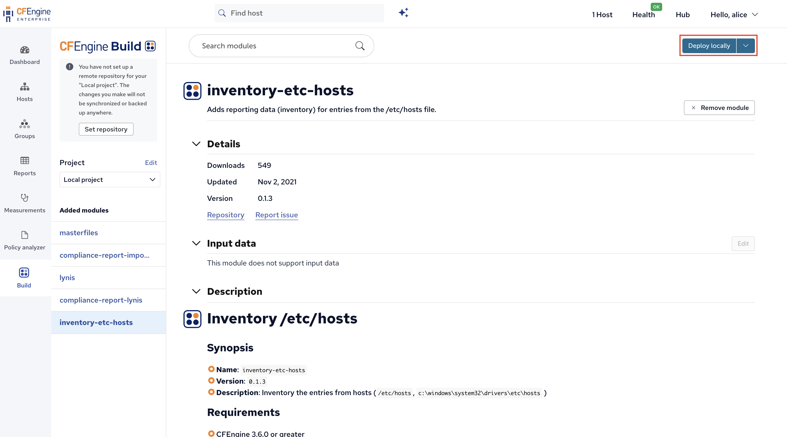

## Step 4: Observe

Now, our modules are running on the hub and any other hosts in the infrastructure, and new reporting data will start arriving.
Let's open the **Reports** application:

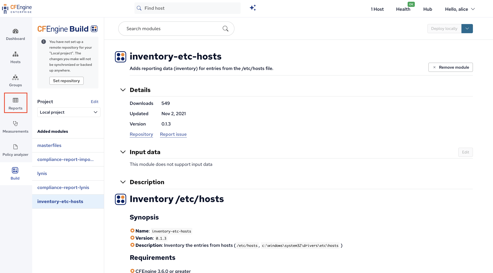

Go to the **CFEngine Build** tab to find reports added by CFEngine Build modules:

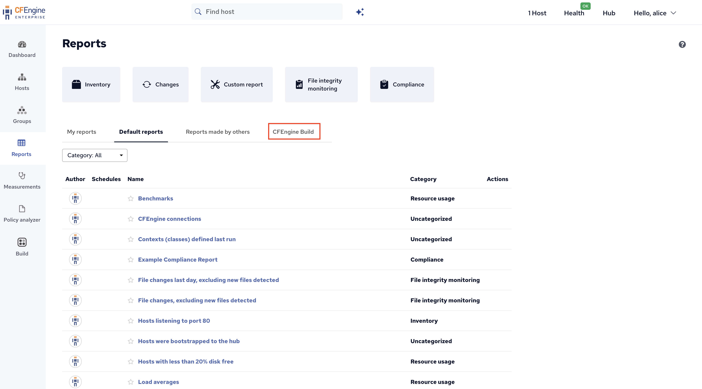

And click on the new Lynis report:

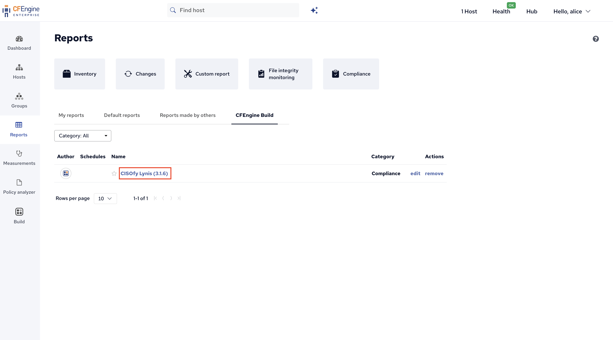

You will now see the new report and its results:

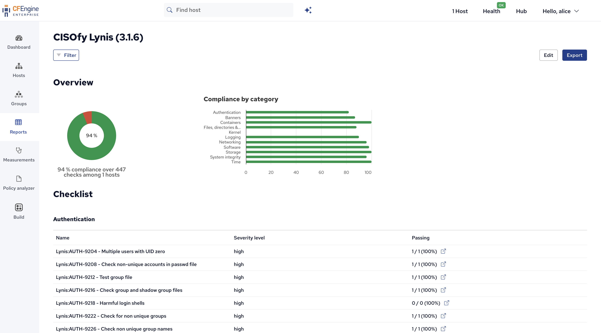

In this case, you can scroll through the report, look at the failing checks and find potential security hardening improvements highlighted by Lynis.
The other module we added, `inventory-etc-hosts`, does not add a _report_, but instead adds _reporting data_ / inventory.
To find this, go back to the **Reports** application:

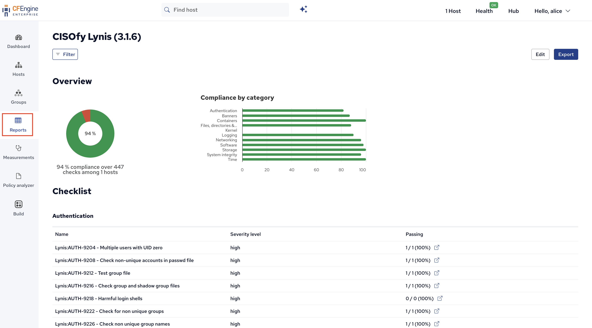

Then, click on **Inventory** to open up a new inventory report:

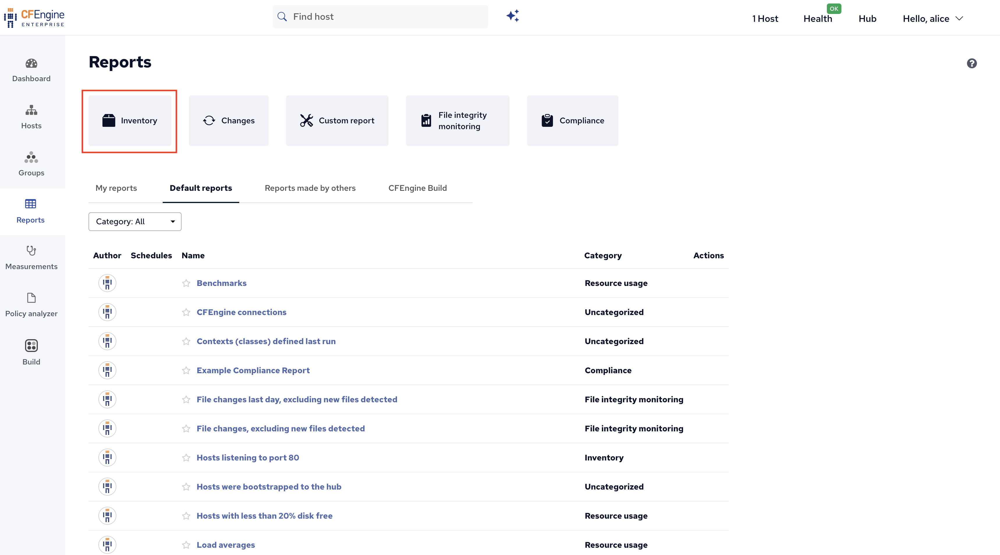

Click on **Columns** so we can add the new data as a new column:

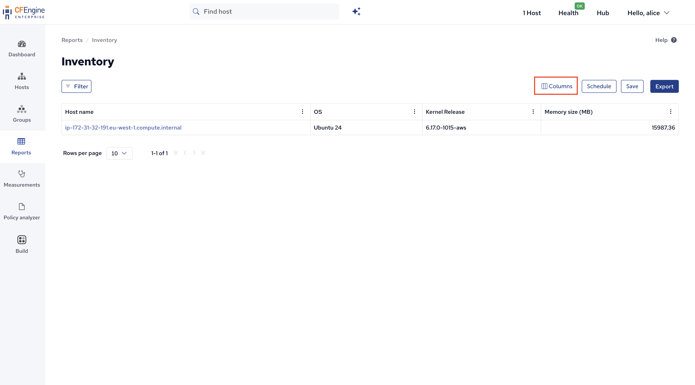

Use the search bar or scroll to find the new data:

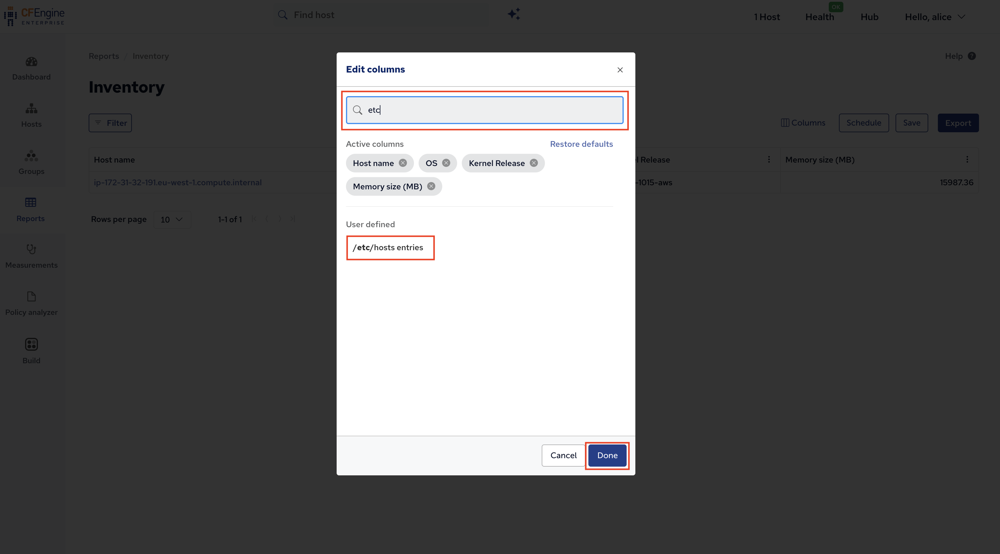

After finding the inventory attribute, clicking **Add** and then **Done** we see it as a new column in the report:

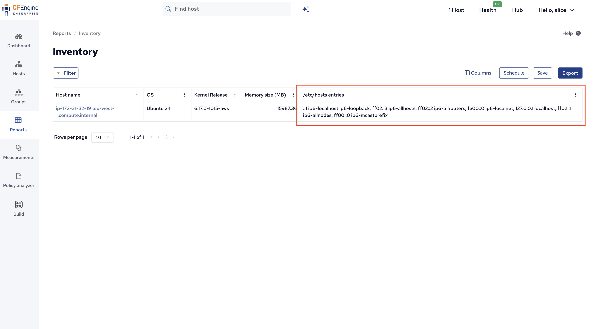

## What's next

This marks the end of the getting started tutorial.
You now have a good foundation to start using CFEngine, finding modules, exploring the Mission Portal web UI, and so on.
If you want to follow some more advanced tutorials, here are some that might be interesting to you:

- [Learn how to use the CFEngine Build command line tools to work with Build projects locally](/examples/tutorials/cfbs/)
- [Introduction to policy writing](/examples/tutorials/policy-writing/)
